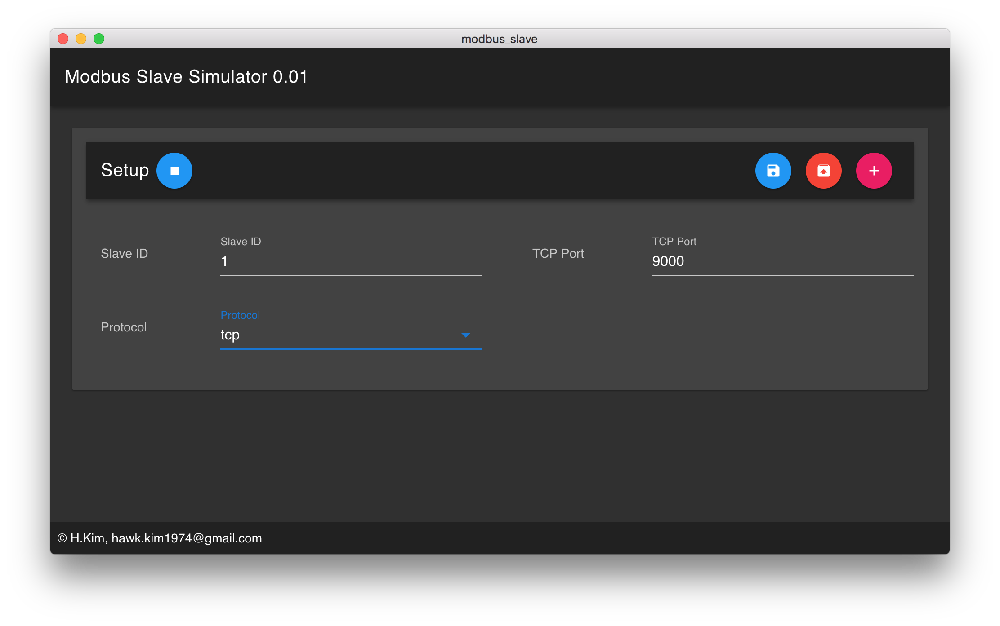

# modbus_slave

!!! This project has been abandoned because I was seeing a need for a completely new design of the internal software.


Please go here [modbus_slave2](https://github.com/peakhunt/modbus_slave2).




> modbus slave@[1c165f7](https://github.com/SimulatedGREG/electron-vue/tree/1c165f7c5e56edaf48be0fbb70838a1af26bb015) using electron and vuetify

#### Build Setup

``` bash
# install dependencies
npm install

# copy modbus-serial tcp patch
cp hkim_mod_back/servertcp.js node_modules/modbus-serial/servers/servertcp.js

# serve with hot reload at localhost:9080
npm run dev

# build electron application for production
npm run build

# run unit & end-to-end tests
npm test


# lint all JS/Vue component files in `src/`
npm run lint

```
